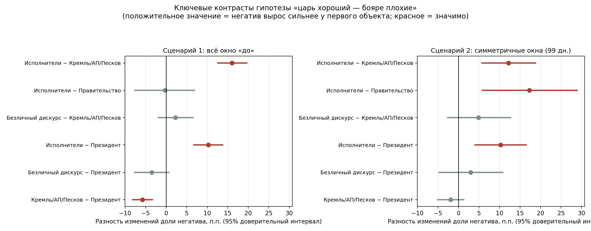

# Динамика публично выражаемого отношения к политическому руководству и ведомствам-исполнителям в условиях государственных ограничений работы Telegram: текст-майнинг постов патриотических Telegram-каналов

В центре проекта – идея текст-майнинга большого количества публикаций: в исходной выборке содержатся **4 435 001 пост из 103 Telegram-каналов декларативно патриотической направленности.** Выборка охватывает периоды с 2015 по 2026 гг. (разброс по каналам различен – собрана вся история постов). Сам же дизайн исследования позволяет проследить то, как изменились тональность и тематическая структура высказываний о разных объектах общественной поддержки – президенте, фигурах или организациях, так или иначе близких к именно политическому руководству (Кремль/АП/пресс-секретарь) и ведомствах-исполнителях ограничений вместе с акторами медийного освещения деятельности ограничений: (Роскомнадзор, Минцифры, профильные депутаты) – после введения государственных ограничений работы Telegram в России (**момент «отсечки» – 16 января 2026**).

## Теоретическая рамка и гипотеза

Исследование опирается на несколько взаимодополняющих линий литературы. Первая – классическое разграничение *специфической* и *диффузной* поддержки политической системы (Easton, 1975): специфическая поддержка адресована конкретным институтам и решениям и эластична к их «выходу», тогда как диффузная относится к режиму и его персонификации и куда устойчивее к краткосрочным шокам. Вторая – представление об объектах поддержки как о «лестнице» (Norris, 2011): от политического сообщества и принципов режима на верхних ступенях до институтов исполнения и конкретных должностных лиц на нижних, причём недовольство, возникающее внизу, вовсе не обязано подниматься вверх. Третья линия – литература о *blame avoidance* (Ellis, 2021; Hood, 2010; Weaver, 1986): институциональный дизайн и риторические практики, позволяющие политическому центру переадресовывать вину за непопулярные решения исполнителям-«громоотводам». Наконец, кейс помещается в давнюю историко-культурную рамку «наивного монархизма» (Field, 2025) – фольклорную формулу «царь хороший – бояре плохие», применимость которой к современной российской публичной сфере и проверяется эмпирически.

Из этой рамки выводится центральная **гипотеза** исследования: после введения ограничений Telegram негативная тональность патриотического сегмента концентрируется на ведомствах-исполнителях и связанных с ними публичных фигурах, тогда как тональность упоминаний первого лица значимо не ухудшается – иначе говоря, недовольство остаётся на нижних ступенях «лестницы поддержки» и не транслируется вверх, к персонификации режима.

Случай примечателен тем, что ограничению подвергся сам канал коммуникации исследуемых акторов: «патриотические» каналы – лоялистский сегмент, для которого Telegram остаётся основной публичной площадкой, – оказались непосредственно затронуты решением государства, которое они в целом поддерживают. Это создаёт редкую квазиэкспериментальную ситуацию для наблюдения за тем, куда лоялистская аудитория направляет недовольство, когда объектом претензий потенциально становится государство, к которому такие акторы обычно обращаются именно с комплементарных позиций.

## Ключевые результаты

Гипотеза находит подтверждение в двух независимых операционализациях – агрегированной документной тональности и прямом кодировании адресата вины (развёрнутое изложение с интерпретацией – [`results/README.md`](results/README.md)).

**Тональность.** После отсечки доля негативных постов о ведомствах-исполнителях выросла на 12 процентных пунктов при и без того высокой исходной базе, тогда как тональность упоминаний президента осталась статистически почти неизменной; негатив в адрес «расширенного руководства» (Кремль, АП, пресс-секретарь) и вовсе снизился – во многом потому, что повестка этих упоминаний сместилась к переговорно-дипломатической:

| Объект поддержки | Доля негатива до → после | Δ, п.п. (95% доверительный интервал) |
|---|---|---|
| Ведомства-исполнители (РКН, Минцифры, Шадаев, профильные депутаты) | 47.9% → 60.0% | **+12.1** [+9.1, +15.2] |
| Президент (корпус без постов с иностранными лидерами) | 36.3% → 38.1% | +1.8 [+0.1, +3.4] |
| Кремль / АП / Песков | 43.9% → 39.9% | −4.0 [−5.8, −2.1] |

Главный статистический тест гипотезы – контраст изменений **Δнегатив(исполнители) − Δнегатив(президент) = +10.3 п.п. [+6.8, +13.8]** – значим как при сравнении со всем доограничительным периодом, так и в симметричных 99-дневных окнах, и устойчив к составу сентимент-ансамбля (sensitivity-анализ на двухмодельном ансамбле воспроизводит направление и значимость эффекта).

**Направление вины.** Независимая от сентимент-моделей операционализация – LLM-кодирование адресата претензий в 1 363 постах по девятикатегорийной схеме (двойное кодирование 10% выборки, каппа Коэна 0.61) – даёт ещё более выразительную картину: лично президенту адресовано **0.1%** претензий (один пост из 1 244 послеограничительных), исполнителям – 25.3%. Крупнейшей же содержательной категорией оказывается безадресная «система/государство в целом» (32.5%): вина не персонализируется ни вверх, ни полностью вниз, а **деперсонализируется** – наблюдение, уточняющее модель «лестницы»: когда приемлемого именованного виновника нет, критика уходит вбок, в диффузный антиинституциональный регистр.

Отдельный сюжет: каналы замечают сам механизм переадресации вины и иронизируют над ним. Рамку «блокировками занимается Роскомнадзор, Кремль ни при чём» производит официальный спикер, а в постах, где уровни власти встречаются вместе, 18.6% послеограничительных текстов составляет мета-ирония именно над этой рамкой – вплоть до буквального «царь хороший – это злые бояре всё». «Наивный монархизм» патриотического сегмента предстаёт, таким образом, не наивной верой, а отрефлексированной коммуникативной нормой.



## Данные: единственный источник правды

Источником данных служит реляционная база SQLite **`patriot_channels_posts_20260423_233414.sqlite`** – 4 435 001 пост 103 каналов (полные истории публичных каналов, собранные через Telethon; срез 23 апреля 2026 г.). База – единственный вход всего конвейера и **единственный распространяемый источник данных**: каждый производный артефакт репозитория – корпуса, тематические модели, тональности, агрегаты – воспроизводится из неё запуском `reproduce.sh`. В сам репозиторий база не входит из-за размера (11 ГБ; ~1 ГБ в сжатом виде) и раздаётся отдельно – см. раздел [«Получение данных»](#получение-данных).

Из базы пословными фильтрами с защитными правилами («гардами») строятся аналитические корпуса; все объёмы ниже даны для окна анализа 24.02.2022–24.04.2026, до и после отсечки 16.01.2026:

| Корпус | Состав запроса | До | После |
|---|---|---|---|
| Президент (v2) | путин\*, президент\*, верховн\*, алиасы (ВВП, «первое лицо», нацлидер, главковерх) – с гардами от иностранных лидеров и омонимии | 155 014 | 6 585 |
| A. Исполнители | Роскомнадзор/РКН/ТСПУ, Минцифры, Шадаев, депутаты-комментаторы | 4 346 | 1 254 |
| B2. Руководство без президента | Кремль, АП, Вайно, Кириенко, Песков | 43 788 | 2 834 |
| C. Безличный дискурс о блокировках | сочетание «платформа × ограничение» без упоминания акторов | 2 143 | 890 |
| Опциональные уровни | правительство (Мишустин/кабмин); парламент (Володин/Матвиенко); ФАС/Генпрокуратура | 5 133; 3 567; 2 401 | 189; 125; 176 |

## Методология

Конвейер состоит из пяти этапов; точные параметры каждого зафиксированы в `reproduce.sh`.

1. **Фильтрация корпусов.** Детерминированные пословные запросы (токенизация razdel, лемматизация pymorphy3, страновой индекс CLDR) с гардами от омонимии («свинцовый», Боярский-актёр, казанский кремль), иностранных объектов (президенты других государств, Верховная Рада), подписных футеров и рейтинг-листов каналов. Качество запросов проверялось **многосторонней LLM-валидацией**: четыре волны, 45 агентов в ролях профилировщиков терминов, адверсариальных верификаторов и аудиторов полноты; методология с дословными промптами и схемами структурированного вывода зафиксирована в [`docs/llm_validation_methodology.md`](docs/llm_validation_methodology.md).
2. **Тематическое моделирование.** Динамический BERTopic поверх эмбеддингов `deepvk/USER-bge-m3` (UMAP с фиксированным seed, HDBSCAN), единая модель на объединённом кейс-корпусе с метками объектов – так тематические сдвиги разных объектов сопоставимы в общем пространстве тем.
3. **Тональность.** Ансамбль трёх моделей: `cardiffnlp/twitter-xlm-roberta-base-sentiment`, `seara/rubert-base-cased-russian-sentiment` и zero-shot `deepvk/GeRaCl-USER2-base`; устойчивость выводов проверена sensitivity-анализом на двухмодельном ансамбле.
4. **Статистика «до/после».** Доли тональностей с 95-процентными доверительными интервалами (бутстреп, 5 000 повторений), χ²-тесты, контрасты разностей изменений между объектами; два сценария сравнения – полное доограничительное окно и симметричные 99-дневные окна вокруг отсечки.
5. **Кодирование направления вины.** LLM-разметка 1 363 постов по девятикатегорийной схеме адресата претензий (от «президент лично» до «система в целом» и мета-иронии над официальной переадресацией) с двойным кодированием 10% выборки: raw agreement 0.72, каппа Коэна 0.61.

Известные ограничения метода – документная тональность не тождественна отношению к актору, короткое послеограничительное окно, валидация кодировщика схемой LLM-против-LLM – последовательно разобраны в [`results/README.md`](results/README.md#5-ограничения). Показательный пример работы контроля качества – аудит контрфактической динамики Роскомнадзора, вскрывший и устранивший асимметричный шум рекламных подписей ([`results/data/audit_rkn_dinamika.md`](results/data/audit_rkn_dinamika.md)).

## Воспроизводимость

Проверка воспроизводимости оформлена как самостоятельный контур: полный протокол – [`REPRODUCE.md`](REPRODUCE.md), единая точка входа – `reproduce.sh`, автоматическая сверка с эталоном – `verify_reproduction.py` (28 контрольных точек: счётчики фильтров, объёмы корпусов и агрегатов, доли тональностей до/после в обоих сценариях, состав итогового пакета). Этапы фильтрации и статистики детерминированы бит-в-бит; GPU-этапы (эмбеддинги, тональность) воспроизводятся с описанными в протоколе допусками. Текущий статус эталона: **PASS=28, WARN=0, FAIL=0**.

```bash
# два conda-окружения (точные версии заморожены в env/)
conda create -n topic-sentiment python=3.10 && conda activate topic-sentiment
pip install -r env/requirements_topic-sentiment.txt
conda create -n geracl python=3.11
~/.conda/envs/geracl/bin/pip install -r env/requirements_geracl.txt

export PY=~/.conda/envs/topic-sentiment/bin/python
export GERACL_PY=~/.conda/envs/geracl/bin/python
export GERACL_MODEL=<путь к чекпойнту deepvk/GeRaCl-USER2-base>

./reproduce.sh check    # окружение и входные данные на месте?
./reproduce.sh verify   # сверка готовых артефактов с эталоном (≈3 сек)
./reproduce.sh all      # полный перепрогон конвейера из базы (GPU, ~6–10 ч)
```

## Структура репозитория

```
├── README.md                        ← этот файл
├── REPRODUCE.md                     ← протокол воспроизводимости (28 автопроверок)
├── reproduce.sh                     ← единая точка входа: check|filters|topics|sentiment|stage3|package|verify|all
├── verify_reproduction.py           ← автосверка артефактов с эталоном reproduce_expected.json
│
├── import_patriot_data_to_sqlite.py     этап 0 (происхождение БД): сырые JSONL → SQLite
├── filter_president_v2_from_sqlite.py   этап 1: корпус президента (v2)
├── filter_putin_posts_from_sqlite.py    этап 1: legacy-корпус президента (v1, справочный)
├── filter_executors_from_sqlite.py      этап 1: корпуса исполнителей A/B2/C/GOV/PARL/AGENCIES
├── scan_executor_candidates.py          разведочный скан кандидатов для валидации запросов
├── audit_president_prep.py              подготовка выборок аудита президентского запроса
├── dynamic_topics_sentiments.py         этапы 2–3: BERTopic + сентимент-ансамбль
├── run_geracl_zeroshot.py               этап 3: zero-shot GeRaCl (отдельный env, multi-GPU)
├── analyze_executors_before_after.py    этап 4: агрегаты «до/после», контрасты, доверительные интервалы
├── analyze_top_delta_topics_sentiment.py вспомогательный разбор топ-тем
├── build_results_package.py             этап 5: сборка пакета results/
│
├── env/                             замороженные зависимости двух conda-окружений
├── requirements.txt                 базовые зависимости (исторический список)
│
├── docs/
│   └── llm_validation_methodology.md        методология LLM-валидации (промпты, схемы)
│
├── outputs/                         лёгкие артефакты: сводки фильтров, валидационные
│   ├── president_audit/             выборки и результаты, кодировки вины, аудит РКН
│   ├── blame_coding/                (крупные производные корпуса — вне git, см. ниже)
│   └── rkn_register_audit/
│
└── results/                         итоговый пакет: рисунки 01–06, данные, интерпретация
    ├── README.md                    ← развёрнутые выводы исследования
    └── data/
```

## Получение данных

Распространяется **один обязательный артефакт** – сжатая SQLite-база (zstd даёт на ней 11-кратное сжатие: 11 ГБ → 1016 МБ); [ссылка на архив](https://drive.google.com/file/d/1XCrGsocUAWbiQ1XUBZhe-dHgQSMs5vWp/view?usp=sharing).

```bash
# распаковать в корень репозитория
zstd -d patriot_channels_posts_20260423_233414.sqlite.zst
./reproduce.sh check   # убедиться, что база на месте и окружение собрано
```

Всё остальное – корпуса, parquet с темами и тональностями, эмбеддинги, агрегаты – производные артефакты: они генерируются из базы командой `./reproduce.sh all` (GPU, ~6–10 часов обработки на пользовательском оборудовании).

## Этические замечания

Анализируются исключительно публичные посты открытых каналов; предметом исследования выступает риторика поддержки власти каналов как медиа-акторов, а не персональные данные пользователей. Полные тексты доступны только в отдельно распространяемой базе.

## Цитирование

```
Динамика публично выражаемого отношения к политическому руководству и
ведомствам-исполнителям в условиях государственных ограничений работы
Telegram: текст-майнинг постов патриотических Telegram-каналов (2026).
https://github.com/densertensor/telegram-text-mining-project
```
